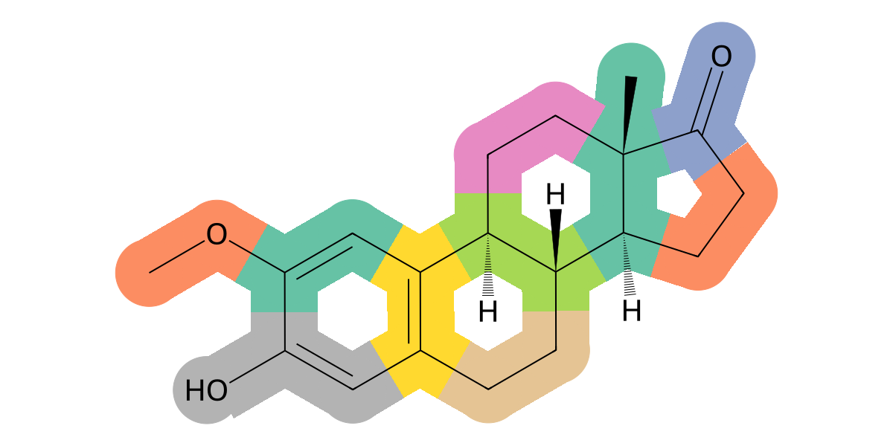
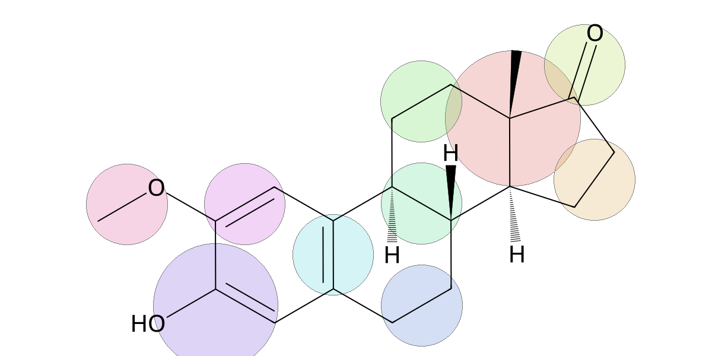

# iConMapper: An automated mapping tool for iConMetabolites   
This is a retrained DSGPM-TP model using iConDataset. For model details, please follow the original papers of [DSGPM](http://dx.doi.org/10.1039/D0SC02458A) and [DSGPM-TP](https://doi.org/10.1021/acs.jctc.4c01466)   

## Requirements
- matplotlib==3.4.3
- networkx==3.2
- numpy==1.22.3
- pexpect==4.9.0
- Pillow==10.2.0
- pyswarms==1.3.0
- rdkit==2023.9.4
- Requests==2.31.0
- scikit_learn==1.3.2
- scipy==1.8.1
- seaborn==0.13.2
- scikit-image
- torch==2.1.2
- torch_geometric==2.4.0
- tqdm==4.66.1
- tensorboard

## Training
```

```

## Mapping (Prediction)
use **MappingPrediction.py** to predict the mapping of new metoblites   
```
usage: MappingPrediction.py [-h] [--name NAME] --smiles SMILES [--output OUTPUT] [--num NUM] [--labels] [--style STYLE]

iConMapper — CG mapping via DSGPM-TP

options:
  -h, --help       show this help message and exit
  --name NAME      Molecule name (default: molecular formula)
  --smiles SMILES  SMILES string of the molecule
  --output OUTPUT  Output directory (default: ./aa2cg)
  --num NUM        Number of CG beads (default: n_heavy_atoms // 3)
  --labels         Overlay bead type labels on the output image
  --style STYLE    Visualization style: 1=colored beads, 2=circles (default: 1)
```
### style1
 

### style2
